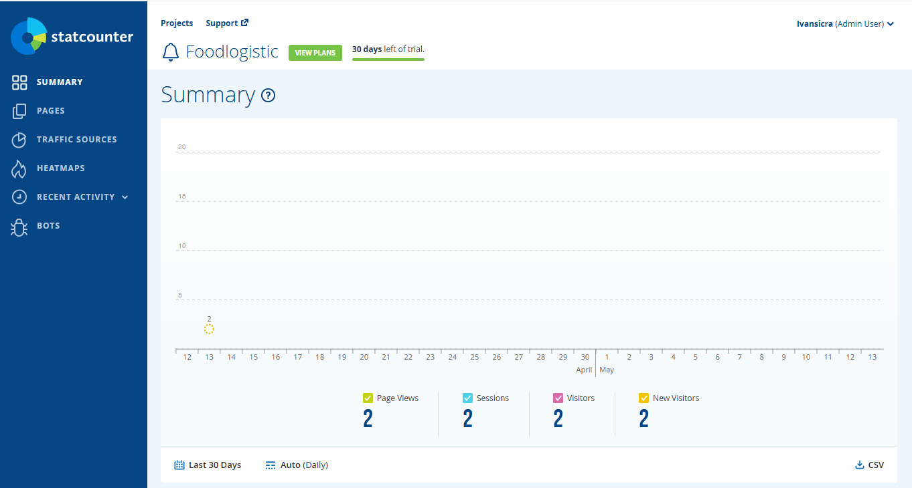
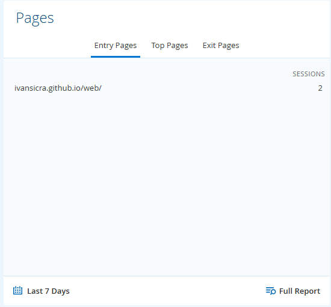
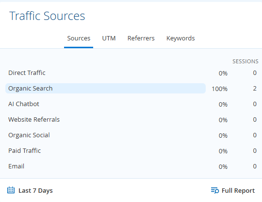
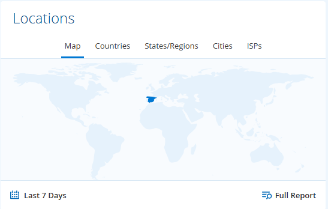
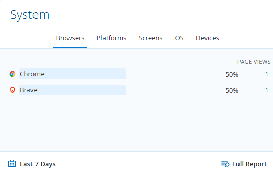
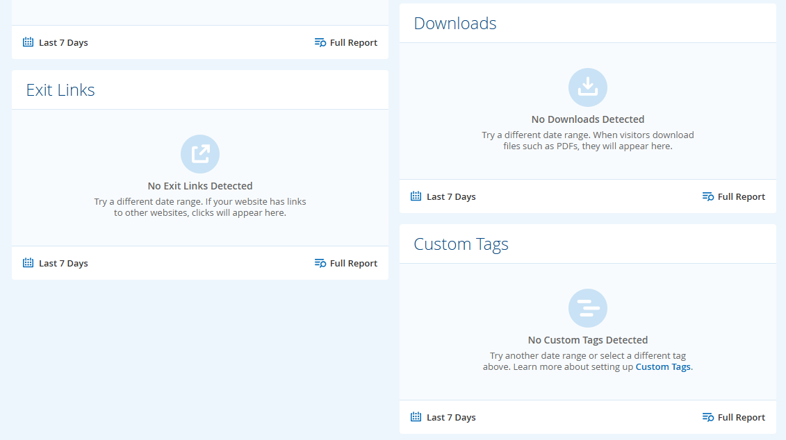
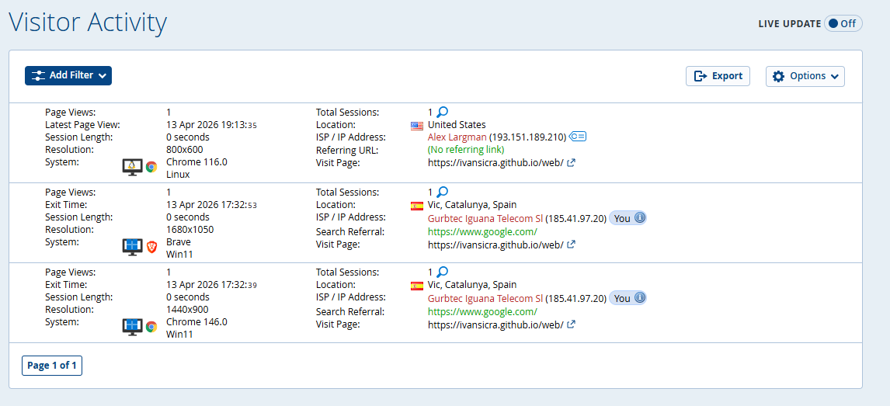

# Introducció al cas

Una de les primeres inquietuds que us han fet arribar des de **FoodLogistic S.A.** és que la seva presència a Internet ha de millorar.

Per una banda, la pàgina web actual s’ha quedat estètica i tècnicament desactualitzada i, a més, no compleix la normativa actual (**LOPDGDD** i **LSSI-CE**).

Per aquest motiu, ens demanen una proposta. No volen veure una prova funcional, així que caldrà publicar el contingut a un servidor real per demostrar al client com quedarà la seva nova identitat digital.

En aquesta activitat, posarem en pràctica la guia de desplegament que teniu a la vostra disposició per assolir tres objectius clau:

---

## 🎯 Objectius

### 🌐 Publicació Professional
Utilitzareu **GitHub Pages** per convertir el vostre codi en una web operativa sota una URL pública.

### 📄 Documentació del Projecte
Cal crear un fitxer **README.md** professional que serveixi com a carta de presentació de la vostra empresa i del seu autor.

### 📊 Control i Analítica
No es pot millorar el que no es mesura. Per això, integrareu una eina de control de la web com **StatCounter** per saber exactament qui visita la web de la vostra empresa.

---

## 🔑 Punts clau

- Crear un repositori al vostre GitHub personal que caldrà documentar adequadament amb un arxiu `README.md`
- GitHub Pages requereix una estructura específica:
  - Carpeta `/docs`
  - Fitxer `index.html`
  - Resta d’arxius de la web dins d’aquesta carpeta
- Configurar la branca principal (`main`) perquè actualitzi la web automàticament en cada canvi
- Treballar en local i pujar només versions estables per evitar desplegaments constants
- Implementar un **“comptador invisible”** amb StatCounter per fer seguiment de les visites

---

## 📚 Materials i enllaços de suport

- Guia de l’activitat:  
  https://github.com/SMX2n/Projecte7-GitHubPages

- Document amb les dades de **FoodLogistic S.A.**

---

## 📦 Què cal lliurar

Dins del repositori del projecte:

- Crear la carpeta `T02`
- Incloure un fitxer `README.md` amb:
  - Breu descripció del projecte
  - Explicació de la solució realitzada
  - Enllaç al vostre repositori personal
  - URL de la pàgina web publicada
  - Captures de pantalla
  - Explicació de les mètriques obtingudes amb StatCounter

---

## 👤 Tipus d’activitat

Aquesta és una activitat **individual**, tot i que posteriorment haureu de triar una solució conjunta.

## Estadístiques del web
Un cop accedim a les estadístiques del nostre web podrem comprovar que dos dispositius diferents s'han connectat a la nostra web.

Del total de persones que han accedit a la web podem veure quantes han accedit concretament a cada pàgina de la web, en aquest cas podem veure que tots dos dispositius només han vist la pàgina inicial.

A més, podem veure qui hi habia darrere de cada dispositiu, en aquest cas ha sigut una busqueda organica, el que significa que eren dues persones físiques buscant el nostre web.

Per altra banda, podrem veure des de quins països s'ha accedit al web, i des de quin navegador s'ha fet la recerca.

Per a webs que permetin descarregar fitxers i/o tinguin enllaços externs en les seves pàgines, en les estadístiques també s'hi podrà gestionar aquestes dades.

En aquesta pantalla podem veure tots els detalls de forma resumida, en aquest cas podem veure que un nou dispositiu situat a Estats Units ha vist el nostre web.

